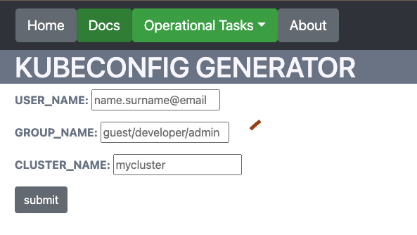

# Sisyphus

[](https://github.com/ugur99/sisyphus/actions/workflows/docker-image-build.yml) 


>Sample Illustration of how RBAC works in kubernetes. [source](https://miro.medium.com/max/1554/1*N6qwMn-4W3Fry2VJBnBu4g.png)

## About

Sisyphus is designed as a project to provide a solution for managing authentication/authorization of many kubernetes clusters. In the case that you have hundreds of kubernetes clusters and you may want tighten up the security of these clusters, you can define RBAC for users or groups. If there are many clusters that you have to deal with, the binding these roles to groups could be better practice than binding to users.


## How it Works?
You can simply give three variables: user names (can be given multiple names with using commas), group name (should be predefined) and target cluster name.




## Nginx Sidecar
We use Nginx Sidecar to decide whether requests are allowed or not by checking the existence of the header given in nginx configuration.


## Useful Commands:

```
python csr-generator.py --username ugur --groupname developer --clustername minikube

openssl req -text -noout -verify -in user.csr

openssl rsa -in user.key -check

openssl x509 -in user.crt -text -noout
```
