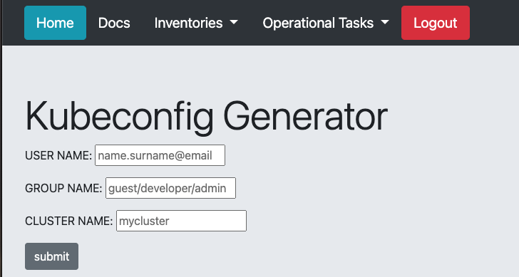
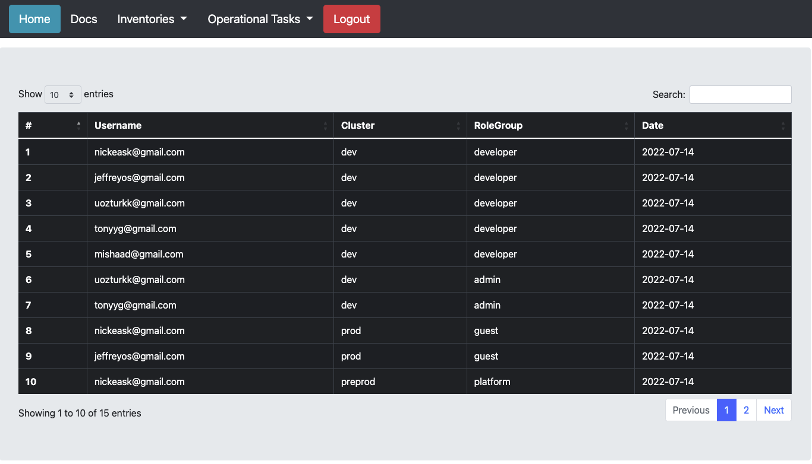

# Sisyphus

 

## About

Sisyphus is designed as a project to provide a simple solution for managing authentication/authorization of many kubernetes clusters. In the case that you have hundreds of kubernetes clusters and you may want tighten up the security of these clusters, you can define RBAC for users or groups. If there are many clusters that you have to deal with, the binding these roles to groups could be better practice than binding to users.

## How it Works?
You can simply give three variables: user names (can be given multiple names with using commas), group name (should be predefined) and target cluster name.

We can list the users and related cluster/rolegroup informations. 

